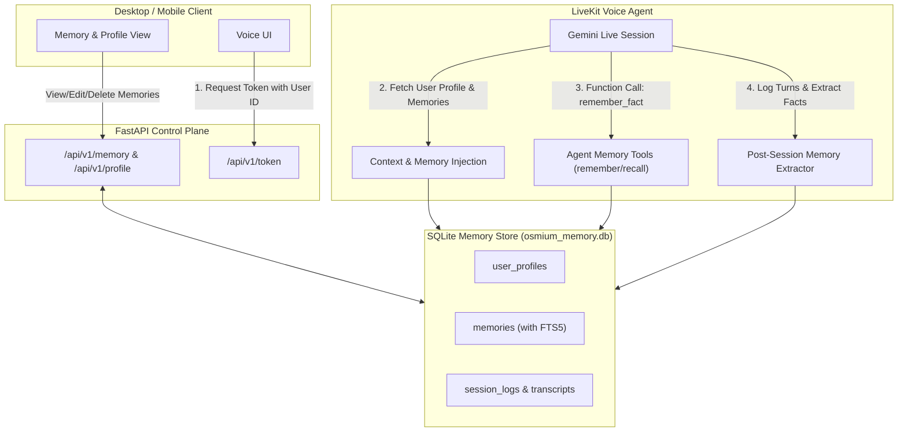

# Memory & Personalization Subsystem Implementation Plan

## Overview
This plan establishes a persistent **Long-Term Memory & Personalization** engine for OsmiumCore. It enables the voice assistant to remember user identity, preferences, ongoing projects, and conversation history across sessions and devices (Desktop and Mobile), while also integrating real-time memory extraction and dynamic context injection into the LiveKit Voice Agent.

In addition, the system architecture documentation ([ARCHITECTURE.md](file:///u:/WRK2/OsmiumCore/ARCHITECTURE.md)) will be updated with the complete future roadmap pillars.

---

## User Review Required

> [!IMPORTANT]
> **Storage Engine Selection:** 
> We propose using **SQLite with FTS5 (Full-Text Search)** + async connection pooling as the primary local storage engine. This provides zero external server overhead, instant startup, transactional safety, and full cross-platform compatibility. In future steps, vector embeddings (via Gemini Embeddings) can seamlessly layer on top of this schema.

> [!NOTE]
> **Identity Handling:**
> LiveKit participants identify themselves via `participant_identity` (e.g. `user-desktop`, `user-mobile`, or custom `user_id`). The memory manager will resolve user profiles and memory records against this identity so context is synchronized across clients.

---

## Architecture & Data Flow



---

## Proposed Changes

### Documentation & Architecture

#### [MODIFY] [ARCHITECTURE.md](file:///u:/WRK2/OsmiumCore/ARCHITECTURE.md)
- Update Architecture Document with Section 7: **Future Strategic Roadmap** containing all feature categories:
  1. Voice & Engine Pipeline (Local Fallback, Dynamic Engine Switcher, Smart Turn Detection, Multi-Voice Presets)
  2. Tools & Function Calling (Desktop Automation, Web Search, Code Execution, File System Q&A, IoT)
  3. Memory & Personalization (Long-Term Memory, Conversation History, Cross-Device Sync)
  4. Client Enhancements (Floating Widget, Push-to-Talk, Screen Awareness/Vision, Live Captions)
  5. Infrastructure & Admin (Telemetry Dashboard, Multi-User Auth, Native Packaging)
- Add technical specification for the Memory & Personalization layer.

---

### Backend: Database & Memory Engine

#### [NEW] [Backend/app/core/database.py](file:///u:/WRK2/OsmiumCore/Backend/app/core/database.py)
- SQLite database initialization, table creation, migrations, and async connection management.
- Tables:
  - `user_profiles`: `user_id`, `display_name`, `voice_preference`, `system_prompt_overrides`, `created_at`, `updated_at`
  - `memories`: `id`, `user_id`, `category` (fact, preference, project, personal), `content`, `importance`, `created_at`, `last_accessed_at`
  - `memories_fts`: SQLite FTS5 virtual table for keyword & full-text memory search
  - `session_logs`: `session_id`, `user_id`, `room_name`, `summary`, `created_at`
  - `conversation_turns`: `id`, `session_id`, `role`, `content`, `timestamp`

#### [NEW] [Backend/app/services/memory_service.py](file:///u:/WRK2/OsmiumCore/Backend/app/services/memory_service.py)
- High-level Memory Service:
  - `get_or_create_profile(user_id)`
  - `get_formatted_user_context(user_id, max_memories=10)` -> Formats profile + top memories into an injection-ready prompt block.
  - `add_memory(user_id, category, content, importance)`
  - `search_memories(user_id, query)`
  - `delete_memory(memory_id, user_id)`
  - `log_conversation_turn(session_id, user_id, role, content)`
  - `extract_and_persist_facts(user_id, session_id)` -> Background task to extract key facts from recent dialogue.

---

### Backend: REST API Endpoints

#### [NEW] [Backend/app/api/v1/memory.py](file:///u:/WRK2/OsmiumCore/Backend/app/api/v1/memory.py)
- REST endpoints for managing user profile, memories, and session transcripts:
  - `GET /api/v1/profile/{user_id}`
  - `PUT /api/v1/profile/{user_id}`
  - `GET /api/v1/memory/{user_id}` (Supports search query filtering)
  - `POST /api/v1/memory/{user_id}`
  - `DELETE /api/v1/memory/{user_id}/{memory_id}`
  - `GET /api/v1/sessions/{user_id}`

#### [MODIFY] [Backend/app/main.py](file:///u:/WRK2/OsmiumCore/Backend/app/main.py)
- Mount the new memory router under `/api/v1`.
- Initialize database on FastAPI startup event.

#### [MODIFY] [Backend/requirements.txt](file:///u:/WRK2/OsmiumCore/Backend/requirements.txt)
- Add `aiosqlite>=0.20.0` for non-blocking asynchronous SQLite access.

---

### Backend: LiveKit Voice Agent Integration

#### [MODIFY] [Backend/agent/main.py](file:///u:/WRK2/OsmiumCore/Backend/agent/main.py)
- In the LiveKit entrypoint:
  1. Retrieve `participant_identity` from the connected participant.
  2. Load user profile and long-term memories via `memory_service.get_formatted_user_context()`.
  3. Dynamically inject the personalized context into `OsmiumAssistant` instructions.
  4. Register memory tools (`remember_fact`, `recall_facts`) so the agent can autonomously store/retrieve memories during conversations.
  5. Hook into conversation turn events to log user/assistant utterances and schedule background fact extraction.

---

### Desktop Client: Memory & Personalization UI

#### [MODIFY] [DesktopClient/src/services/api.ts](file:///u:/WRK2/OsmiumCore/DesktopClient/src/services/api.ts)
- Add API client methods for:
  - `fetchUserProfile(userId)`
  - `updateUserProfile(userId, data)`
  - `fetchMemories(userId, query?)`
  - `createMemory(userId, data)`
  - `deleteMemory(userId, memoryId)`

#### [MODIFY] [DesktopClient/src/App.tsx](file:///u:/WRK2/OsmiumCore/DesktopClient/src/App.tsx)
- Add a collapsible **"Memory & Knowledge"** panel allowing users to:
  - Configure their User Identity (syncs with Mobile).
  - View all facts remembered by OsmiumCore.
  - Manually add or delete memories.
  - Edit personalized assistant instructions / name.

---

## Verification Plan

### Automated / Backend Tests
- Create a test script `Backend/tests/test_memory.py` to verify:
  - Database initialization and schema creation.
  - Adding, searching, and deleting memories.
  - Profile creation and update.
  - Context prompt formatting.
  - FTS5 keyword retrieval.
- Run tests:
  ```powershell
  python -m unittest Backend.tests.test_memory
  ```

### Manual Verification
1. **API Validation:**
   - Start FastAPI (`scripts/1-backend.bat` or `python -m uvicorn Backend.app.main:app`).
   - Use `curl` or Swagger UI (`http://localhost:8000/docs`) to test `/api/v1/memory` and `/api/v1/profile` endpoints.
2. **Agent Live Voice Test:**
   - Start LiveKit & Agent (`scripts/2-agent.bat`).
   - Connect via Desktop Client (`scripts/3-desktop.bat`).
   - Tell the assistant a fact (e.g. *"Remember that my favorite programming language is Rust"*).
   - Disconnect and reconnect in a new session.
   - Ask the assistant: *"What is my favorite programming language?"*
   - Verify that the assistant recalls the fact accurately from persistent memory.
3. **UI Verification:**
   - Open Desktop Client and inspect the Memory Panel to verify that the fact is visible and can be managed.
